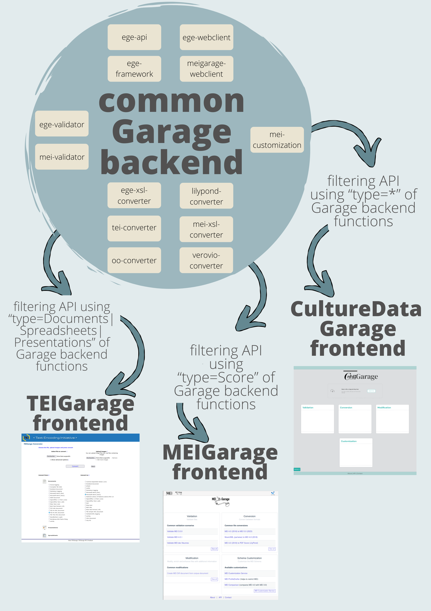

# Using multiple frontends with Garage code structure

A common backend of multiple functions for different file formats and types can be accessed by and used with different frontends by filtering the type of functions in the backend API.

